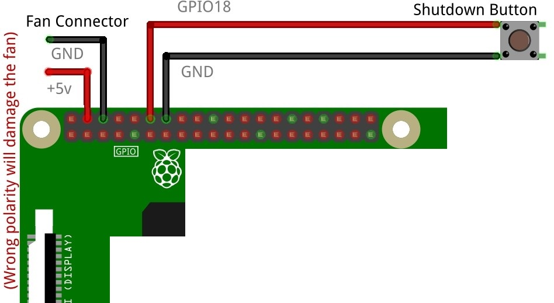

#This script is created by Brijesh Mishra and available as open source utility for Raspberry Pi enthusiastics.

The Unio Smart Case
Raspberry Pi 4

https://github.com/Unio-IoT/smart-case/blob/master/Diagram.jpg

* Unio and Unio Smart Case logo and designs are trademarks/patent or registered trademarks/patent of Unio IoT Pvt. Ltd. and/or its affiliates in the India and/or other countries, and may not be used without written permission.
* Python is a registered trademark of the PSF (Python Software Foundation).
* Raspberry Pi and the Raspberry Pi Logo are a registered trademark of the Raspberry Pi Foundation, which is a UK registered charity.
